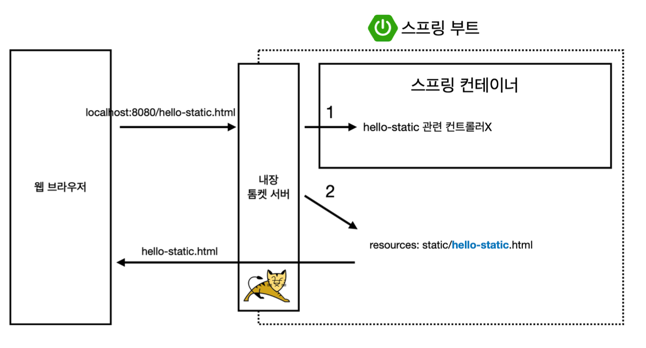

## 스프링 웹 개발 기초

### 정적 컨텐츠

Web server가 정적리소스(hello-static.html)를 바로 띄워줌

**MVC패턴이란 ?**
-> Model, View, Controller로 쪼개둔 패턴. 
비즈니스 로직은 controller에서 다 처리하고, 이를 model에 넘겨 화면에 필요한 정보들을 처리한다

MVC패턴과 API 방식의 차이
MVC패턴은 html태그를 붙이며, 내가 입력하는 내용을 뒤에서 조작하여 view를 띄워주나, 

API는 문자 내용을 직접 반환한다. (source를 보면 태그없이 텍스트 그대로 반환됨)

