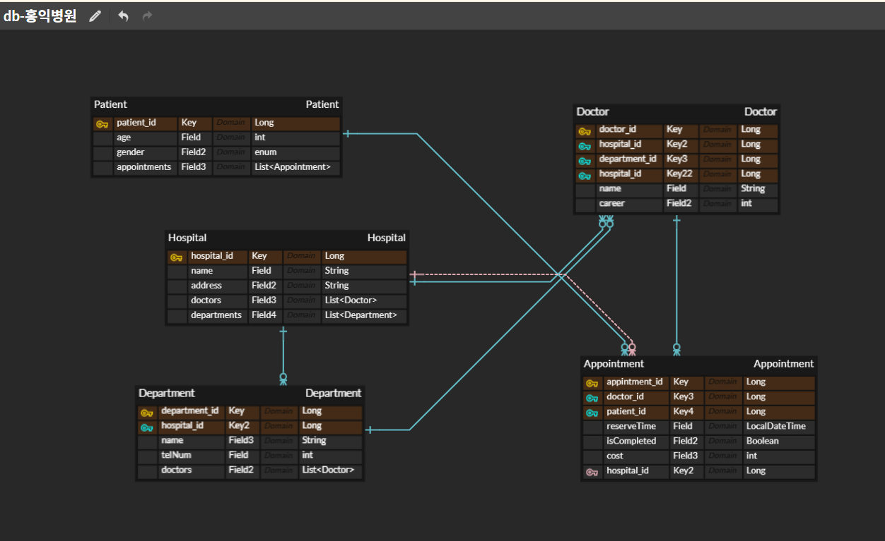
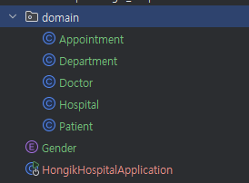
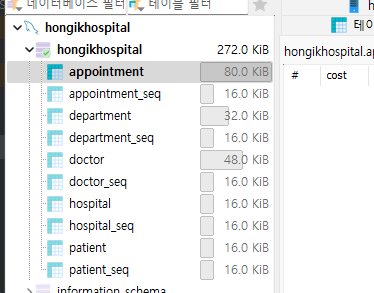

10주차 과제 - 홍익병원 

1. erd 설계

2. 엔티티 생성 후, db 연결

3. api 설계

   "환자는 ID로 부여받아 식별되며, 나이, 성별 등의 신상 정보를 유지해야 한다." 
    - POST /patients
    - GET /patients/{patientId}
    - PATCH /patients/{patientId}

    "병원은 ID로 부여받아 식별되며, 이름·주소·진료과 정보 제공"
   - POST /hospitals
   - GET /hospitals/{hospitalId}

   "병원 내에서 이름으로 식별되며, 전화번호·소속 의사 확인 가능"
   - POST /departments
   - GET /departments/{departmentId}
   - GET /departments{departmentId}/doctors : 해당 진료과 소속 의사 목록

   "의사는 ID로 식별되며, 이름·병원·진료과·경력 포함"
   - POST /doctors
   - GET /doctors/{doctorId}
   - GET /doctors?hospitalId={hospitalId}&departmentId={departmentId}

   "예약은 환자·의사·병원·진료과·시간으로 구성되고, 각 환자는 한 의사에게 하나만 예약 가능"
   - POST /appointments
   - GET /appointments
   - DELETE /appointments/{appointmentId}

