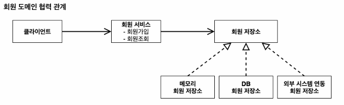
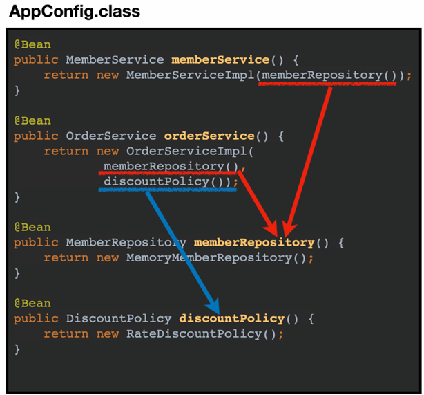

# umc 2,3주차 README

# Section 2. 객체 지향 설계와 스프링

### 스프링

- 스프링 프레임 워크
    - 스프링 DI 컨테이너, AOP, 이벤트
    - 스프링 MVC, 스프링 WebFlux
    - 트랜잭션, JDBC, ORM 지원, XML 지원
    - 캐시, 이메일, 원격접근, 스케줄링
    - 스프링 기반 테스트
    
- 스프링 부트 : 스프링 설정을 쉽게..!
    - Tomcat 서버가 내장되어 있다.
    - 외부 라이브러리 호환 버전 관리
    - 스프링보다 간결한 설정 환경

- 스프링
    - 스프링 DI 컨테이너
    - 스프링 프레임워크 전체
    - 스프링 부트, 스프링 프레임워크를 포함한 스프링 생태계..
    - 스프링은 좋은 객체 지향 애플리케이션을 개발할 수 있게 도와주는 프레임워크

### 객체지향

- 추상화, 캡슐화, 상속
- **다형성** Polymorphism : 클라이언트를 변경하지 않고, 서버의 구현 기능을 유연하게 바꿀 수 있다.
    - **역할(인터페이스)**과 **구현(객체, 클래스)**으로 구분
        - 클라이언트는 내부 구조를 몰라도 된다.  대상의 **역할**(**인터페이스**)만 알면 된다.
        - 클라이언트는 구현 대상을 변경해도 영향 받지 않는다.
        → 구현이 계속 많아질 수 있음. 확장성 多
        - 상속을 자유롭게 다중으로 구현 가능
    - 오버라이딩 : 부모 클래스로부터 상속받은 메소드를 자식 클래스에서 **재정의** 한 것.
        - 인터페이스의 구현 인스턴스를 실행 시점에 유연하게 변경할 수 있다.
    - 오버로딩 : 메소드의 이름이 같지만, 매개변수의 개수나 타입이 달라야 한다. 리턴값은 조건이 아님.

다형성 만으로는 OCP와 DIP를 지킬 수 없다.

### **SOLID**

- SRP 단일 책임 원칙:
    - 한 클래스는 하나의 책임만 가져야 한다 →변경이 있을 때, 파급이 가능한 가장 적어야 함 ex. AppConfig
- **OCP** 개방-폐쇄 원칙:
    - 소프트웨어 요소는 확장에는 열려 있고, 변경에는 닫혀있어야 한다.
    - 기존 코드를 고치지 않고, 새 기능을 추가할 수 있어야 한다.
    - DiscountPolicy 인터페이스를 사용하는 OrderService가 있을 때,
    FixDiscountPolicy, RateDiscountPolicy 같은 구현체를 바꾸더라도
    OrderService는 변경하지 않고, 설정 파일(AppConfig)만 바꾸면 됨.
- LSP 리스코프 치환 원칙성
    - 성능이 좋지 않아도 정해진 규약 지키기
- ISP 인터페이스 분리 원칙
- **DIP** 의존관계 역전 원칙
    - 구현 클래스에 의존하지 말고, 인터페이스에 의존하기. (구체화에 의존하지말고, **추상화**에 의존하기)

- DI (Dependency Injection) : 의존관계, 의존성 주입

※ 인터페이스는 추상화라는 비용이 발생한다. (ex. 개발자가 어떤 객체를 썼는지 코드를 한 번 더 열어봐야 함) → 따라서 기능을 확장할 가능성이 없다면, 구체적인 클래스를 직접 사용하는 게 좋다.

# Section3. 스프링 핵심원리 이해 1 - 예제 만들기

## <비즈니스 요구사항>

- 회원
    - 회원을 가입하고 조회할 수 있다.
    - 회원은 일반과 VIP 두 가지 등급이 있다.
    - 회원 데이터는 자체 DB를 구축할 수 있고, 외부 시스템과 연동할 수 있다. (미확정)
- 주문과 할인 정책
    - 회원은 상품을 주문할 수 있다.
    - 회원 등급에 따라 할인 정책을 적용할 수 있다.
    - 할인 정책은 모든 VIP는 1000원을 할인해주는 고정 금액 할인을 적용해달라. (나중에 변경 될 수 있다.)
    - 할인 정책은 변경 가능성이 높다. 회사의 기본 할인 정책을 아직 정하지 못했고, 오픈 직전까지 고민을 미루고 싶다. 최악의 경우 할인을 적용하지 않을 수도 있다. (미확정)

### <회원 도메인 설계>




*Impl : 구현

- 클래스 다이어그램 → 정적
    
    
    
    *Impl : 구현
    


- 객체(실제 참조되는 클래스의 인스턴스) 다이어그램 → 동적
    
    
    

---

### <회원 도메인 개발>

- 내가 원하는 **속성** ex. grade → **enum** 으로 만들어두기
- 클래스 → 생성자, getter, setter 만들기
- 인터페이스, 구현체는 원래 다른 패키지에 둔다
    - 인터페이스 : 기능 선언
    - 구현체 : 인터페이스에 선언된 기능 구현
        - 데이터 **저장**을 해야하니까 **HashMap** 만들기

<Member package>

멤버 클래스 → id, name, grade

인터페이스와 구현체

- MemberRepository
    - MemoryMemberRepository
    - DBMemberRepository
- MemberService
    - MemberServiceImpl  → MemberRepository **인터페이스의 구현 객체**가 필요하다..!!
        - ~~없으면 NullPointException 터짐~~
    
    //`private final MemberRepository memberRepository = **new MemoryMemberRepository()**;`
    
    → 다형성 有 : MemberRepository의 기능들을 MemoryMemberRepository에 적용시킬 수 있다.
    
    ※ DIP 위반 : 실제 할당되는 부분(new ~)이 인터페이스가 아닌, 구현체를 의존하고 있다.
    

- TEST는 Junit 이용!!

---

### <주문과 할인 도메인 설계>

- 주문과 할인 정책
    - 회원은 상품을 주문할 수 있다.
    - 회원 등급에 따라 할인 정책을 적용할 수 있다.
    - 할인 정책은 모든 VIP는 1000원을 할인해주는 고정 금액 할인을 적용해달라. (나중에 변경 될 수 있다.)
    - 할인 정책은 변경 가능성이 높다. 회사의 기본 할인 정책을 아직 정하지 못했고, 오픈 직전까지 고민을 미루고 싶다. 최악의 경우 할인을 적용하지 않을 수 도 있다. (미확정)


### <주문 도메인 개발>

- OrderServiceImpl 의 메소드 implements 인터페이스
    - 주문 생성해서, 적용 사항(회원가입과 할인) 적용한 주문 결과를 반환
        - MemberRepository의  MemoryMemberRepository 인스턴스가 필요함
        - DiscountPolicy의 FixDiscountPolicy 인스턴스가 필요함
    - 주문 생성 요청이 오면
        - 회원 정보 조회
        - 할인 정책에 회원 정보 넘기기
        - 회원 정보에 알맞는 할인된 가격(discountPrice) 받기
        - 최종 생성된 주문 정보 반환

---

### 정리!

- 객체를 찍어낼 **클래스** -> 생성자, getter, setter 정의 필요.
- 인터페이스(Service) ← 구현체(Impl)
    - **구현체**에서 메소드 재정의 **@Override**
    
- 레포리토지 인터페이스에서는
    - DB에서 데이터 가져오기, JPA의 자바 엔티티와 DB 매핑 관리
    - CRUD 메서드 제공
        - 메서드가 호출되면, JPA는 그 데이터를 SQL문을 통해 DB에서 조회하고, 엔티티 객체로 변환시켜서 반환한다.

- 서비스 인터페이스에서는
    - 실제 비즈니스 로직(예. 회원가입, 아이디로 회원 찾기 ..) 제공

# Section 4. 스프링 핵심 원리 이해 2 - 객체 지향 원리 적용


                                                                                       ??..


할인 정책 인터페이스의 정률 Rate 할인 정책 구현체를 추가하자!

- 역할과 구현을 분리하고, 다형성을 활용했지만,
    - 구현체(OrderServiceImpl)가 인터페이스(DiscountPolicy) 뿐만 아니라, 그의 구현체(RateDiscountPolicy)도 의존하고 있다.
        
        → **DIP** (의존관계 원칙) 위반
        
    - 할인 정책을 변경하는데, OrderServiceImpl 코드를 고쳐야 한다. (참조를 바꿔야 돼서)
        
        → **OCP** (변경에는 폐쇄적이여야 함) 위반
        

남주인공 배역의 “배우”는 여주인공 배역의 배우를 초빙하면 안 된다. 
배역을 수행하는 것, 공연에만 집중해야 한다.  (*배역=인터페이스, 배우=구현체) 

그니까 여태까지 뽑는 사람은 안 만들었고, 배역과 배우만 만든 것이다!

→ 공연 기획자 라는 초빙하는 일을 하는 인터페이스를 만들어야 한다! (SRP OK)

## AppConfig

- AppConfig 등장 :애플리케이션의 전체 동작 방식을 구성(config)하기 위해, **설정 클래스**를 만들자.
    
    → AppConfig 는 배역에 맞는 배우를 직접 뽑는다.
         즉, 애플리케이션의 실제 동작에 필요한 구현 객체를 AppConfig에서 주입한다.
    
    - 가의존 구현체 코드에서 피의존 구현체를 의존하던 부분을 삭제하고, 
    인터페이스만 남겨둔다 (DIP OK)
    - AppConfig 코드에 **인터페이스의 생성자**를 만든다. → 의존 관계를 **생성자로 주입한다.**
    - 생성자의 **반환값**에서, 가의존 구현체를 new 인스턴스 생성하여,
    피의존 구현체를 **인자**로 넣어준다. → 의존 관계 주입

→ MemberServiceImpl 구현은 이제부터 의존 관계에 대한 고민은 **외부**에 맡기고, 실행에만 집중


※ OrderServiceImpl 은 두 가지 인터페이스(MemberRepository, DiscountPolicy)를 의존해야 됨

- `private final MemberRepository memberRepository; 
 private final DiscountPolicy discountPolicy;`
    - 일반 필드(클래스)는 객체가 만들어질 때 초기화 된다. → 컴파일 타임에 생성자가 하나도 없으면 기본 생성자가 자동 추가됨.
    - **final 필드**는 생성 시점과 동시에 **명시적으로** 값이 할당돼야 한다! → **생성자**에서 꼭 초기화해줘야함

※ 테스트 환경에서는 각 인터페이스의 필드를 한번만 new 해서 쓰게 되면, 여러 테스트가 같은 인스턴스를 공유하게 된다. → **@BeforeEach**로 각 테스트 실행 전, fresh하게 초기화를 해줘야 함

- AppConfig 리팩터링
    
    
    
    - 인터페이스의 다른 구현체로 교체할 때, AppConfig 의 한 부분만 변경하면 된다.
    - 리팩토링 전 : 인자에 `new` 로 피의존 구현체 객체를 직접 생성했는데,
    - 리팩토링 후 : 인터페이스 생성자를 **모두** 명시적으로 만들어줌. 중복 제거!
                              역할과 구현 클래스가 한 눈에 들어옴.
    
    - 구성(Config) 영역에만 영향 有, 사용 영역에는 영향 無
    
    
    
    ```java
    public class AppConfig {
    
        public MemberService memberService(){
            return new MemberServiceImpl(memberRepository()); 
        }
    
        private MemberRepository memberRepository() {
            return new MemoryMemberRepository();
        }
    
        public OrderService orderService(){
            return new OrderServiceImpl(memberRepository(), discountPolicy());
        }
    
        public DiscountPolicy discountPolicy(){
            return new RateDiscountPolicy();
        }
    }
    ```
    
    - Service들은 인터페이스, Impl 은 실제 비즈니스 로직 구현체
    - 각각 **생성자 주입 방식**으로 의존성을 주입하고 있다.
        - 서비스는 레포리토지를 이용하여 데이터를 처리해야 한다. 
        (따라서 서비스는 레포에 의존)

---

- 제어의 역전 IoC (Inversion of Control)

구현 객체는 자신의 로직을 실행하는 역할만 담당하고, 프로그램의 **제어 흐름**은 **AppConfig**가 가져간다.

- 프레임워크 ↔ 라이브러리
    - 프레임워크 :  내가 작성한 코드를 제어하고, 대신 실행하면! ex. @Test의 Junit
    - 라이브러리 : 내가 작성한 코드가 직접 제어하면!

- 의존관계 주입
    - 정적인 클래스 의존 관계 : import ~, implements 만 보고 쉽게 의존 관계 파악
    - 실행 시점에 결정되는, 동적인 **객체 의존 관계** : 런타임 중에 실제 구현 객체가 생성되고, 그 참조값을 클라이언트에 전달한다.

→ 의존 관계 주입 = 런타임 중에 **외부**에서 구현 객체를 생성하여, 클라이언트에 전달하면, 클라이언트와 서버의 실제 의존 관계가 연결 되는 것

- IoC 컨테이너, DI 컨테이너
    - AppConfig 같이 구현 객체 생성하고, 제어 흐름을 결정하는 애
    - 의존 관계 주입에 초점(DI 컨테이너)  ex. Spring
    - Impl 입장에서는 외부에서 의존성을 주입 받는 것 같다고 해서 의존성 주입.

---

## Spring 전환

- AppConfig 를 스프링 중심으로 바꾸기
    - @Configuration  : 구성 정보, 설정 정보 (AppConfig에다가 설정을 구성한다는 뜻)
    - @Bean : 스프링 컨테이너에 등록 (기본적으로 메소드 이름을 빈의 이름으로 등록)

```java
ApplicationContext applicationContext = new AnnotationConfigApplicationContext(AppConfig.class);
```

- ApplicationContext : 스프링 컨테이너, @Bean 객체들을 스프링 컨테이너에 등록
- @Configuration 붙은 AppConfig 에 있는 환경 설정 정보를 이용
- 빈 꺼내쓰기 : `applicationContext.getBean(빈 이름, 지정 클래스)`

# 3주차 README

### Section 5. 스프링 컨테이너와 스프링 빈

```cpp
//스프링 컨테이너 생성
ApplicationContext applicationContext = 
                        new AnnotationConfigApplicationContext(AppConfig.class);
```

ApplicationContext 는 스프링 컨테이너이자, **인터페이스**이다. (다형성 有)

AnnotationConfigApplicationContext 는 위 인터페이스의 **구현체** 중 하나.

new AnnotationConfigApplicationContext(**AppConfig.class**)

- AppConfig.class : 구성 정보(설정 정보)
- @Bean 의 이름끼리는 절대 겹치면 안 된다..
  - **메소드 이름**이 Bean 이름으로, 메소드 **리턴값의 객체**를 Bean 객체로 저장됨.
  - @Bean(name=”다른 이름”) → 빈이름 이렇게 기본값말고 임의 부여 가능
- AppConfig 설정정보를 기반으로 스프링 컨테이너를 생성하여 초기화.

※ `AnnotationConfigApplicationContext` 클래스에 직접 의존하고 있어 DIP 원칙을 준수하지 않는 구조.

의존 관계 주입(DI)



- 스프링은 빈을 생성하는 단계와, 의존 관계를 주입하는 단계가 나누어져 있다.
- 하지만 저렇게 자바 코드로 @Bean을 등록하면, 자동으로 생성자를 호출하면서 동시에 **동적인** 의존 관계 주입도 처리된다.
  → 그래서 Config 로 하면, 실제로는 한 번에 의존 관계가 전부 주입된다.

<스프링 빈 조회하기>

- 컨테이너에 등록된 모든 빈 출력하기
  - `ac.getBeanDefinitionNames()` : 빈 이름
  - `ac.getBean()` : 빈 객체
- 어플리케이션 빈 출력하기 (사용자가 등록한 빈)
  - `beanDefinition.getRole() == BeanDefinition.***ROLE_APPLICATION***`

<스프링 빈 조회하기 by name, type>

- `ac.getBean("memberService", MemberServiceImpl.class);`
  - 스프링 컨테이너에 등록된 “memberService” 라는 **이름**의 빈을 MemberServiceImpl **구현체** **타입**으로 가져온다.  → 구체 타입 조회는 DIP에 어긋나긴 한다.
  - 타입을 **인터페이스**로 해도, 인터페이스 생성자의 반환 객체 타입을 조회하기 때문에 해당 인터페이스의 구현체 빈 객체들이 조회됨

※ 검증은 항상 `Assertions.assertThat()` 으로!

<스프링 빈 조회하기 - 동일한 type 이 존재할 때>

```cpp
  @Configuration //@Bean 수동 추가
  **static** class SameBeanConfig{
      @Bean
      public MemberRepository memberRepository1(){
          return new MemoryMemberRepository();
      }
      @Bean
      public MemberRepository memberRepository2(){
          return new MemoryMemberRepository();
      }
  }
```

- static : 이 클래스 안에서만 쓸 때 (테스트 코드 안에서만 사용)

- 타입으로 조회시, 같은 타입이 둘 이상 있으면 중복 오류가 발생한다.
  - 그래서 같은 타입 빈이 여러 개 있으면 조회 할 때 빈 이름을 지정하면 된다.
  - @getBean → 오류, @getBeansofType → 오류 X

```cpp
public class ApplicationContextSameBeanFindTest {
  AnnotationConfigApplicationContext ac  = new AnnotationConfigApplicationContext(**SameBeanConfig.class**);
  // 어플리케이션 컨텍스트를 내가 만든 구성정보 클래스를 기반으로 만들어야 한다!..

  @Test
  @DisplayName("타입으로 조회시 같은 타입이 둘 이상 있으면 중복 오류가 발생한다.")
  void findBeanBtTypeDuplicate() {
      Assertions.assertThrows(**NoUniqueBeanDefinitionException**.class,
              () -> ac.getBean(MemberRepository.class));
  }
  
  @Test
  @DisplayName("타입으로 조회시 같은 타입이 둘 이상 있으면, **빈 이릉을 지정하면 된다.**")
  void findBeanByName() {
      MemberRepository memberRepository = ac.getBean("memberRepository1", MemberRepository.class);
      org.assertj.core.api.Assertions.assertThat(memberRepository).isInstanceOf(MemberRepository.class);
  }

  @Test
  @DisplayName("특정 타입을 모두 조회하기")
  void findAllBeanByType() {
      Map<String, MemberRepository> beansOfType = ac.**getBeansOfType**(MemberRepository.class);
      for (String key : beansOfType.keySet()) {
          System.out.println("key = " + key + ", value = "+ beansOfType.get(key));
      }
      org.assertj.core.api.Assertions.assertThat(beansOfType).hasSize(2);
  }
  .
  . //SameBeanConfig class
  .
 }
```

<스프링 빈 조회하기 - 상속관계>

부모 타입을 조회하게 되면, **자식 타입도 전부 함께 조회된다.**

ex. 자바 객체의 최고 부모인 **Object 타입**으로 조회하면, 모든 스프링 빈을 조회하게 된다.

- 부모 타입으로 조회시, 자식이 둘 이상 있으면, **중복 오류**가 발생한다.
  - 그래서 같은 자식 빈이 여러 개 있으면 조회 할 때 빈 이름을 지정하면 된다.

```cpp
 @Configuration
    static class TestConfig {
        @Bean
        public DiscountPolicy rateDiscountPolicy() {
            return new RateDiscountPolicy();
        }
        @Bean
        public DiscountPolicy fixDiscountPolicy() {
            return new FixDiscountPolicy();
        }
        // DiscountPolicy의 자식 빈 2개 Fix, Rate
    }
```

```cpp
public class ApplicationContestExtendsFindTest {
    AnnotationConfigApplicationContext ac =  new AnnotationConfigApplicationContext(TestConfig.class);
		// 어플리케이션 컨텍스트를 내가 만든 클래스를 기반으로 만들어야 한다!
		
    @Test
    @DisplayName("부모 타입으로 조회시, 자식이 둘 이상 있으면, **중복 오류**가 발생한다.")
    void findBeanByParentTypeDuplicate(){
        Assertions.assertThrows(NoUniqueBeanDefinitionException.class,
                () -> ac.getBean(DiscountPolicy.class));
    }

    @Test
    @DisplayName("부모 타입으로 조회시, 자식이 둘 이상 있으면, **빈 이름**을 지정하면 된다.")
    void findBeanByParentTypeBeanName(){
        DiscountPolicy rateDiscountPolicy = ac.getBean("rateDiscountPolicy", DiscountPolicy.class);
        org.assertj.core.api.Assertions.assertThat(rateDiscountPolicy).isInstanceOf(RateDiscountPolicy.class);
    }

    @Test
    @DisplayName("특정 하위(자식) 타입으로 조회") // 안 좋은 방법.. OCP 
    void findBeanBySubType(){
        DiscountPolicy bean = ac.getBean(RateDiscountPolicy.class);
        org.assertj.core.api.Assertions.assertThat(bean).isInstanceOf(RateDiscountPolicy.class);
    }

    @Test
    @DisplayName("부모 타입으로 모두 조회하기")
    void findBeanByParentType() {
        Map<String, DiscountPolicy> beansOfType = ac.get**Beans**OfType(DiscountPolicy.class);
        org.assertj.core.api.Assertions.assertThat(beansOfType.size()).isEqualTo(2);
        for (String key : beansOfType.keySet()) {
            System.out.println("key= "+ key+ ", value= "+beansOfType.get(key));
        }
        // 실제 테스트 코드에서는 출력을 만들면 안 된다!!

@Test
    @DisplayName("부모 타입으로 모두 조회하기 -Object")
    void findBeanByObjectType() {
        Map<String, DiscountPolicy> beansOfType = ac.getBeansOfType(DiscountPolicy.class);
        for (String key : beansOfType.keySet()) {
            System.out.println("key= "+ key+ ", value= "+beansOfType.get(key));
        }
    } // 사용자가 등록한 빈 뿐만 아니라 스프링 내부 라이브러리 빈까지 다나옴..........
```

---

**BeanFactory**

- 스프링 컨테이너의 최상위 부모 인터페이스
- 스프링 빈을 관리하고 조회한다.
  - ex. `ac.**getBean**()`

**ApplicationContext**

- BeanFactory 를 상속 받은 인터페이스 - 빈 관리 및 조회 + 부가기능
  - 메세지 소스 (전세계 국제화 기능)
  - 환경 변수 (로컬, 개발-테스트, 운영 등 각 환경 별로 어떤 DB를 연결해야 할지)
  - 애플리케이션 이벤트
  - 편리한 리소스 조회

**AnnotaionConfigApplicationContext**

- Application을 상속 받은 구현 객체
- 설정 정보로 AppCinfig.class 사용
- `AnnotationConfigApplicationContext`가 **`ApplicationContext`** 인터페이스를 구현하고 있기 때문에 이런 식으로 형식 지정 가능.
  - 자바에서는 부모 타입으로 자식 객체를 참조할 수 있다.

```java
 ApplicationContext ac = new AnnotationConfigApplicationContext(AppConfig.class);
```

---

스프링 컨테이너(ApplicationContext)는 다양한 형식의 **설정 정보**를 받아들일 수 있게 설계됨.

- 자바 : AnnotaionConfigApplicationContext → AppConfig.class
- XML :  GenericXmlApplicationContext → appConfig.xml

---

BeanDefinition : 빈 설정 **메타정보** → ISP, DIP (BeanDefinition, 즉 **추상화**에만 의존)

- ApplicationContext은 무슨 언어로 적혀있는지 몰라도 되고,
  오직 **BeanDefinition** (메타 정보)만 알면 된다.
- AnnotatedBeanDefinitionReader 가 AppConfig(설정정보)를 읽고, @Bean(<bean>) 하나 당 하나씩 메타 정보가 생성된다.
  - 설정정보를 → beanDefinition으로 추상화
- 스프링 컨테이너는 생성된 메타 정보를 기반으로, 스프링 빈을 생성한다.
  - 직접 스프린 빈 등록하기
  - factoryBean 이용하기

---

<스프링 없는 순수한 DI 컨테이너, AppConfig 정리>

- AppConfig에서 @Bean 생성
- 레포리토지를 통해서 JPA와 상호작용
  - 레포리토지가 서비스 단에서 호출될 때,
    레포리토지는 JPA를 통해 영속성 컨텍스트와 상호작용
  - JPA는 엔티티 매니저를 통해 SQL 쿼리를 날려서 DB 수정 및 조회
  - DB는 받은 쿼리문대로 결과 반환, JPA가 엔티티 객체로 변환
    → 영속성에 엔티티 객체 저장됨

→ 레포리토지는 JPA를 사용하여, DB 결과를 **엔티티**로 바꾸고 어플리케이션에 반환함 !!

---

### Section 6. 싱글톤 컨테이너

웹 어플리케이션은 보통 여러 고객이 동시에 요청을 한다.

- AppConfig는 각 요청마다 새 객체를 생성하고 반환한다.
  - return new 레포리토지();

```java
public class SingletonTest {
    @Test
    @DisplayName("스프링이 없는 순수한 DI 컨테이너")
    void pureContainer(){
        AppConfig appConfig = new AppConfig();
        // 1. 조회(호출1) : AppConfig에 멤버서비스를 호출할 때마다 객체를 생성하는지
        MemberService memberService1 = appConfig.memberService();

        // 2. 조회(호출2) : 호출할 때마다 객체를 생성하는 지
        MemberService memberService2 = appConfig.memberService();

        // 참조값이 다른 지 확인
        System.out.println("memberService1 = "+memberService1);
        System.out.println("memberService2 = "+memberService2);
        
        Assertions.assertThat(memberService1).isNotSameAs(memberService2);
        // 호출한 서비스 객체, 그를 의존하는 레포 객체까지 새로 생성되는 중..
    }
}
```

→ 테스트를 해보면, 반환되는 객체들의 참조값이 다르다.
즉, 서로 다른 새 객체가 호출될 때마다 생성되는 중… 미친 낭비!!

---

싱글톤 패턴 : 클래스의 **객체가 딱 하나만** 생성되게 보장하는 디자인 패턴.

- 여러번 호출되어도, 하나의 객체만을 생성해 전역적으로 사용할 수 있게 하기
  - **static** 키워드 : INSTANCE는 클래스가 load 될 때 메모리에 **한 번 할당**되고, 이 서비스의 모든 인스턴스에서 공유되는 하나의 정적 필드가 됨. (One and Only 필드)
  - **final** 키워드 : INSTANCE 가 생성된 순간 변경되지 않도록 보장, 한 번만 초기화될 수 있음.
- **private 생성자** : 외부에서 new 객체 생성을 막는 가장 손쉬운 방법

※ 테스트 주의점

- isSameAs : 두 객체가 같은 메모리 주소를 참조하는지 == 비교 → 같은 객체인지
- isEqualTo : 두 객체의 값, 즉 내용만 같은지 비교(`equals()` 메서드)

순수 자바가 아닌, **스프링 컨테이너**는 기본적으로 객체를 싱글톤 패턴으로 만든다.

**퓨어 자바**로 구현한 **싱글톤 패턴** (객체를 미리 생성해두는 방법)의 문제점

- 싱글톤 패턴 구현하는 코드가 많이 들어감
  - private static final 어쩌고..
- 구현체에 의존하니 DIP, OCP 위반 확률 높아짐
  - 조회 : `SingletonServiceImpl.getInstance()`
- 유연성 떨어짐
  - `private 생성자` : 자식 클래스를 만들기 어려워짐
  - `final, static 키워드` : 내부 속성 변경이 어려움

---

스프링 컨테이너의 싱글톤 - 싱글톤 레지스트리

- 퓨어한 AppConfig appConfig = new AppConfig(); 말고 **스프링 컨테이너** 이용!!
  - `AnnotationConfigApplicationContext(AppConfig.class);`
- 위에 퓨어 자바 싱글톤 패턴의 단점 전부 상쇄
  - 싱글톤을 위한 부가적 코드 작성 無
  - 더이상 구현체에 의존 X → `ac.getbean(”빈이름”,빈타입)`

---

※ 싱글톤 방식의 주의점 in 멀티쓰레드

- 여러 클라이언트가 하나의 객체 인스턴스를 공유하기 때문에,
  **무상태 (Stateless)**로 설계해야 한다.
  - 가급적 읽기만 가능해야 한다. (특정 클라이언트가 값을 변경할 수 있으면 안 됨)
  - 다같이 **공유되지 않는 지역변수, 파라미터, ThreadLocal** 등을 사용해야 한다.

- `statefulService` 는 스프링 컨테이너에 의해 만들어졌기 때문에, 싱글톤!
  - `statefulService` 1이나 2나 하나의 같은 객체 (공유되는 필드)
  - 공유되는 필드의 값을 변경해서 생긴 문제. 값이 최종 수정 값으로 덮여씌워짐

- 올바른 싱글톤 인터페이스 설계 및 사용법 → Stateless 하게 설계
  - **지역변수 설정하기**

```java
public class StatefulService {

   // private int price; // stateful 필드

    public **int** order(String name, int price) {
        System.out.println("name = " + name + " price = " + price);
        // this.price = price;
                return price;
    }
    /*
    public int getPrice() {
        return price;
    }
    */
}
```

```java
 @Test
 void statefulServiceSingleton() {
	 ApplicationContext ac = new AnnotationConfigApplicationContext(TestConfig.class);
   // 이 스프링 컨테이너는 TestConfig 를 사용한다.
   StatefulService statefulService1 = ac.getBean(StatefulService.class);
   StatefulService statefulService2 = ac.getBean(StatefulService.class);

   // Thread 1
   int userAPrice = statefulService1.order("userA",10000);
   // Thread 2
   int userBPrice = statefulService2.order("userB",20000);

   // int price = statefulService1.getPrice();
   System.out.println(userAPrice);

   Assertions.assertThat(userAPrice).isEqualTo(10000);
   // statefulService 는 스프링 컨테이너에 의해 만들어졌기 때문에, 싱글톤이니까, 1이나 2나 하나의 같은 객체.
}
```

- 상태를 가지는 필드를 수정하면 안 된다..
  애초에 싱글톤 빈 필드에 **상태를 두는 것을 지양**해야 함.
  - **인스턴스 변수** : **this.변수** 는 싱글톤으로 관리되는 공통 객체 하나이다.
  - 그래서 모든 호출에서 동일한 인스턴스 this의 필드값이 참조됨.
    - **힙** 메모리에 저장된다..!!!!!!!!!!!!!!!!!
  - **지역 변수** : 변수는 메서드가 호출 될 때마다 새로 생성되게 됨 (별도의 스택 메모리 공간이 할당됨), 메서드가 종료되면 해당 메모리 공간은 해제된다.
    - **스택** 메모리에 저장되었다가, 메서드 호출이 끝나면 스택에 저장된 모든 지역변수가 사라짐
    - 스택의 값 그대로 반환된 변수 값은 힙 메모리에 남아, 다른 메서드에서 계속 사용 가능


---

AppConfig 코드에서 이상한 점..

- memberService 호출 → memberRepository() → new MemoryMemberRepository()
- orderService 호출 → memberRepository() → new MemoryMemberRepository()

  → 싱글톤이 아니라, **여기서는 똑같은 새 객체를 2개 생성하는 것 같음.**

  - 각자 생성자에서 호출하는 memberRepository의 객체가 동일한 애인지 테스트를 위해, 해당 객체를 의존하는 Impl들에서 해당 객체 반환하는 코드 추가

```java
    public MemberRepository getMemberRepository() {
        return memberRepository;
    } //memberRepository 객체 반환
```

```java
public class ConfigurationSingletonTest {
    @Test
    void configurationTest() {
        ApplicationContext ac = new AnnotationConfigApplicationContext(AppConfig.class);
        
        MemberServiceImpl memberService =ac.getBean("memberService", MemberServiceImpl.class);
        OrderServiceImpl orderService =ac.getBean("orderService", OrderServiceImpl.class);
        MemberRepository memberRepository = ac.getBean("memberRepository", MemberRepository.class);

        MemberRepository memberRepository1 = memberService.getMemberRepository();
        MemberRepository memberRepository2 = orderService.getMemberRepository();

    
        Assertions.assertThat(memberService.getMemberRepository()).isSameAs(memberRepository);
        Assertions.assertThat(orderService.getMemberRepository()).isSameAs(memberRepository);
    }
}
```

※ 원래 구현체의 값을 꺼내오는 행위 → 구현체에 의존하는 것이니 DIP 위반, 테스트 할 때 OCP 위반하게 됨

- 테스트 결과 : 생성자 의존관계에 의해 여러번 호출이 되었음에도, 하나의 같은 객체가 공유돼서 사용 중이다..

스프링에서 관리 안 하냐 하냐 → 싱글톤이 되냐 안 되냐

**@Configuration이 붙은 클래스**에서, 바이트 코드 조작의 마법 : CGLIB

- AppConfig의 빈 타입 : `bean= class hello.core.AppConfig**$$SpringCGLIB**$$0` 가 출력됨
- 순수한 클래스라면 `bean= class hello.core.AppConfig` 가 출력될 것이다.
  - 스프링이 CGLIB 라는 바이트 코드 조작 라이브러리를 사용하여,
    AppConfig 클래스를 **상속**받은 임의의 **다른 클래스**를 만들고, 그 다른 클래스를 스프링 빈으로 등록한 것이다.

*(헉 그니까 결국엔 스프링 컨테이너에는 AppConfig가 등록되지 않고, AppConfig@CGLIB 라는 클래스 객체가 스프링 빈으로 등록되어 있다.)*

(+) AppConfig@CGLIB는 AppConfig의 자식 이므로, **부모**인 AppConfig으**로 조회할 수 있다. (부모로 조회하면 자식 다 끌려나옴!)**

→ @Configuration, @Transactinal 같은 어노테이션은 중복 호출이 예상되기에, 최초에 생성된 인스턴스를 계속 재사용하도록 보장해준다.

정리

- @Bean만 사용해도 스프링 빈으로 등록되지만, 싱글톤을 보장하지 않는다.
- 스프링 설정 정보는 항상`@Configuration`을 사용하자!

---

### Section 7. 컴포넌트 스캔

**Java Config 기반**: `@Configuration`과 `@Bean` 어노테이션을 사용.

- 스프링 빈을 일일이 @Bean 어노테이션을 통해 등록했다.

→ **컴포넌트 스캔** : 설정 정보가 없어도 자동으로 스프링 빈을 등록하는 기능

- 스프링 컨테이너가 @Component가 붙은 클래스를 모두 빈으로 등록시킨다.
- 설정 정보가 없기에, 의존 관계 주입도 클래스 내에서 해결
  - **@Autowired** : 의존 관계 자동 주입

- 생성자의 매개변수 **타입**으로 빈을 찾는다. `getBean(MemberRepository.cass)` 와 동일
- 타입으로 찾으면, 그 타입의 구현체(자식)들이 찾아진다.

```java
@Configuration
**@ComponentScan**(
        excludeFilters = @ComponentScan.Filter(type = FilterType.ANNOTATION, classes = Configuration.class),
        // Configuration 어노테이션이 붙은 애는 수동 등록하는 설정정보
        basicPackages = "hello.core.member"
)
```

- excludeFilters : 컴포넌트 스캔되지 않게, 빼 줄 애들 지정
  (AppConfig 는 @Bean 방식으로 의존관계를 수동 주입 시킨 설정정보이다.)
- basicPackages : 컴포넌트 스캔 대상 **시작 위치**를 member 부터로 정해주기.
  (저기부터 하위 패키지들 탐색)
  - 지정하지 않으면 , @ComponentScan 이 붙은 설정 정보 클래스의 패키지가 시작 위치가 된다.
  - 그냥 **설정 정보** 클래스의 ****위치를 **프로젝트 최상단**에 두자…

```java
@Component
public class MemberServiceImpl implements MemberService {
    private final MemberRepository memberRepository;

    @Autowired
    public MemberServiceImpl(MemberRepository memberRepository) {
        this.memberRepository = memberRepository;
    }
}
```

- `MemberServiceImpl`은 **`MemberService` 인터페이스에 의존**
- 생성자에 **@Autowired**
  - 의존성이 필요한 쪽에서 어떤 빈을 주입 받을 지 스프링에 요청
  - 그리고 스프링이 실제 구현체(`MemoryMemberRepository`)를 직접 주입한다.
    - 생성자의 인자인  `MemberRepository` 타입인 구현체 ↑ 를 찾아와서, 의존 관계를 자동으로 주입시킨다.
  - 두 개 이상의 의존 관계도 한 번에 주입받을 수 있다.

컴포넌트 스캔 (@ComponentScan )대상

- @Component
- @Controller : 클라이언트 요청 처리
- @Service : 비즈니스 로직
- @Repository : 데이터 접근 계층, 데이터 계층의 예외를 스프링 예외로 반환시켜준다.
  - SQL 종류에 따라 발생하는 예외가 다른데, 스프링의 일관된 하나의 방식으로 예외 처리 가능 (코드 재사용성 ↑)
- @Configuration : 스프링 설정 정보, 싱글톤을 유지하도록 추가 처리를 한다.
  - 클래스 내의 정의된 @Bean 을 캐싱한다.

필터

`ApplicationContext ac = new AnnotationConfigApplicationContext(**ComponentFilterAppConfig**.class);`

- includeFilters 에 @MyIncludeComponent 를 추가 → 스프링 빈에 등록된다.
- excludeFilters 에 @MyExcludeComponent 를 추가 → 스프링 빈에 등록되지 않는다.

```java
    @Configuration
    @ComponentScan(
            includeFilters = @ComponentScan.Filter(type = **FilterType**.ANNOTATION,classes = MyIncludeComponent.class),
            excludeFilters = @ComponentScan.Filter(type = FilterType.ANNOTATION,classes = MyExcludeComponent.class)
    )
```

- ANNOTATION : 기본값, 어노테이션을 인식하여 동작
- ASSIGNABLE_TYPE : 지정한 타입과 자식 타입을 인식하여 동작
- ASPECTJ
- REGEX : 정규 표현식 사용
  - CUSTOM :TyprFilter 라는 인터페이스 구현해서 사용

컴포넌트 스캔 中 같은 빈 이름 중복 등록 X

- 자동 빈 등록 끼리 중복 이름 됐을 때
  - `ConflictingBeanDefinitionException` 예외 발생
- 수동 빈 등록 ↔ 자동 빈 등록
  (in Springboot, 컴포넌트 스캔으로 빈이 등록되는데, 수동으로 빈 이름 설정하면)
  - @Bean(name = “ ”)  : 수동 빈 이름 등록이 우선권을 가짐.
  - 수동 빈이 자동 빈을 오버라이딩 한다.
  - 근데 최근에는 그냥 **오류**가 나도록 바뀌었다.