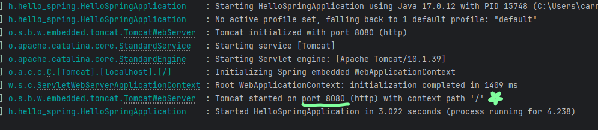

# 제목 없음

## 02. 프로젝트 환경 설정

application 실행 후, 웹 브라우저에서 [localhost](http://localhost):8080 접속 확인



- 스프링 부트니까, 톰캣 내장 웹 서버가 띄워진다

H2 라이브러리 살펴보기

- Gradle은 의존관계가 있는 라이브러리를 함께 다운로드 한다.

스프링 부트 라이브러리

- spring-boot-starter-web
    - spring-boot-starter-tomcat: 톰캣 (내장 웹 서버)
    - spring-webmvc: 스프링 웹 MVC
- spring-boot-starter-thymeleaf: 타임리프 템플릿 엔진(View)
- spring-boot-starter(공통): 스프링 부트 + 스프링 코어 + 로깅
    - spring-boot
        - spring-core
    - spring-boot-starter-logging
        - logback, slf4j (로깅 인터페이스)
        

테스트 라이브러리

- spring-boot-starter-test
    - junit: 테스트 프레임워크
    - mockito: 목 라이브러리
    - assertj: 테스트 코드를 좀 더 편하게 작성하게 도와주는는 라이브러리
    - spring-test: 스프링 통합 테스트 지원

---

## 03. 스프링 웹 개발 기초

### 정적 컨텐츠


### MVC와 템플릿 엔진

- MVC : 요청 → HTML 만들어서 응답
    - Model, View, Controller : model은  view 템플릿 (html)에 데이터를 넘겨주는 역할
- 템플릿 엔진 **thymeleaf** : 서버없이 html 렌더링. 변환!


- 정적 컨텐츠`resource::static`과 다르게,
**동적 컨트롤러**에서, 리턴 값 문자를 반환하고, **뷰** 리졸버가 맞는 화면(템플릿)을 요청
    - `resource::templates/ + 리턴값 문자 + .html` 를 템플릿 엔진에 넘긴다.
- 요청을 받은 템플릿 엔진은, 렌더링을 해서 변환을 한 HTML 을 웹 브라우저에 반환한다.
    
    
    

- @RequestParam : 디폴트값이 true니까, model 매개변수 값을 꼭 같이 넘겨줘야 한다.
    
    
    
    - url ex. `localhost:8080/[매핑값]**?name=[spring!]**`
    - **컨트롤러**에서 name 변수의 값이 [내가 넘긴 값]으로 바꾸고, **model** 에 저장된다.
    - 템플릿은 `${name}` 으로, model 에서 키 값을 꺼내서, 렌더링
    

### API

- html ㄴㄴ, 저 return 값 데이터를 그대로 보여준다. (json으로..)
    
    
    

- @ResponseBody
    
    
    
    - 뷰 리졸버에 던지지 않고,  http body 부분에 리턴 값을 직접 넣는다.
        - return 값이 문자(StringConverter) : 문자값을 http 응답에 바로 넣음
            
            
            
        - return 값이 객체(JsonConverter) : 데이터를 json으로 만들어서 응답 보냄
            
            
            

→ 옛날에는 백엔드에서 직접 html을 만들어 줬지만, 지금은 프론트가 따로 있고 완전히 분리됨!

### <동적 컨텐츠의 두 가지 방식 최종 정리>

- Spring MVC
    - 브라우저 요청→ 컨트롤러 → 모델 → 뷰리졸버 → HTML → 브라우저
    - 서버에서 return “hello” 하면 →서버에서 hello.html 을 렌더링해서 보내줌
- API
    - 프론트 요청→ 컨트롤러 → 서비스 로직 → JSON 응답 → 클라이언트 (프론트)
    - 서버는 JSON 만 만들고, 프론트에서 렌더링

---

## 04. 회원 관리 예제 - 백엔드 개발

### Repository, 인터페이스와 구현체


| 역할 | 이름 | 설명 |
| --- | --- | --- |
| 추상화(규칙) | `MemberRepository` | 인터페이스 : 회원 저장소는 "**이런 기능 있어야 해**" 명세 |
| 실제 구현 | `MemoryMemberRepository` | 인터페이스를 구현한 진짜 저장소 (메모리 사용) |
| 저장 공간 | `store` | 데이터를 "메모리에" 저장하기 위한 변수 (Map 사용) |

→ 오직 인터페이스 MemberRepository 에만 의지한다면?

- 나중에  `MemoryMemberRepository` 대신 다른 DB를 넣어도, 서비스와 컨트롤러는 건드릴 필요가 없다. → **다형성**

```java
MemoryMemberRepository repository = new MemoryMemberRepository();
```

- 근데 이건 구현체에 직접 의존함

- 테스트 (Junit 이용)

```java
    @Test
    public void save(){
        Member member = new Member(); // 테스트 용 가짜 회원
        member.setName("spring");
        repository.save(member); // 저장 기능 이용

        Member result = repository.findById(member.getId()).get(); 
        // 저장소에서 가짜 회원 조회

        System.out.println("저장 테스트 후 조회 결과 = " + (result == member));
        // 만든 가짜 회원과, 그 회원을 저장한 저장소의 회원이 **같은 객체**인가? 
        // 완전히 똑같은 메모리 주소를 가리키는가
    }
```

```java
 // sout 쓰지 않고 같은 객체인지 판단하기
 1. Assertions.assertEquals(member, result); 
 2. org.assertj.core.api.Assertions.assertThat(member).isEqualTo(result);
```

### 비즈니스 로직이 담긴 Service

- Repository는 확실히 저장, 조회 같은 DB와 관련된 간단한 활동이였다면
- Service에는 회원 가입, 중복 회원 검증 같은 실제 비즈니스 로직을 구현한다.

```java
    private final MemberRepository memberRepository;

    public MemberService(MemberRepository memberRepository) {
        this.memberRepository = memberRepository;
    }
```

- new로 객체를 새로 생성하지 말자.
- 인터페이스를 final로 선언한 후, Service 생성자의 매개변수로 넣어주자. → DI

### Controller

- 컨트롤러는 서비스와 레포리토지를 이용한다.
- 클라이언트에게 요청을 받아서 백엔드에 넘겨주는 역할

## 05. 스프링 빈과 의존 관계

- 스프링 빈을 등록하는 2가지 방법
    - 컴포넌트 스캔과 자동 의존관계 설정
        - 어노테이션 (Service, Controller, Repository, Autowired) 이용
            - @Autowired : 스프링이 생성자 매개변수의 객체를 스프링 컨테이너에서 찾아서, **연결**시켜줌
        - 생성자로 의존성 주입 :객체 의존관계를 외부에서 넣어주는 것
    - 자바 코드로 직접 스프링 빈 등록하기
    
    ```java
    @Configuration
    public class SpringConfig {
    
        @Bean
        public MemberRepository memberRepository() {
            return new MemoryMemberRepository();
        }
    
        @Bean
        public MemberService memberService() {
            return new MemberService(memberRepository());
        }
    }
    ```
    


- 컴포넌트 스캔 방식이 아니라, Configuration 파일로 직접 스프링 빈을 등록한다면
    - 설정 파일의 `return new [~~]` [] 부분만 내가 원하는 DB 객체로 바꿀 수 있다.

## 06. 회원 관리 예제 - 웹 MVC 개발

### 등록

```java
    @GetMapping("/members/new")
	    public String createForm(){
	        return "members/createMemberForm";
	    }
```

- 매핑값의 `/members/new` url로 들어가면, 리턴값의 members/createMemberForm .html 파일을 찾는다.

```html
**<form action="/members/new" method="post">**
        <div
                class="form-group">
            <label
                    for="name">이름</label>
            <input
                    type="text" id="name" name="name" placeholder="이름을 입력하세요">
        </div>
        <button type="submit">등록</button>
  </form> // 값을 입력할 수 있는 html 태그
```

- `<form action="/members/new" method="post">` : 등록 버튼을 누르면, 해당 url에 post방식으로 요청

```java
    @PostMapping("/members/new")
    public String create(**MemberForm** form){
        Member member = new Member();
        member.setName(form.getName());

        memberService.join(member);
        return "redirect:/";
    }
```

- 매핑값, http 방식을 모두 만족시키는 요청이 들어오면, 메소드 내용이 실행된다.
    - post는 데이터를 요청에서 같이 넘겨줄 때
    - get은 조회
- 사용자가 입력한 input 값이, 메소드 매개변수 MemberForm의 name 변수로 전달된다.
    - 이후 getname으로 name을 꺼내서, member 객체에 이름 set 후, 회원가입 join 실행

### 조회

```java
    @GetMapping("/members")
    public String list(Model model){
        java.util.List<Member> members = memberService.findMember();
        model.addAttribute("members", members);
        return "members/listMembers";
    }
```

- model에 전체 조회 값을 리스트로 등록

```java
            <tr **th:each**="member : **${members}**">
                <td th:text="${member.id}"></td>
                <td :text="${member.name}"></td>
```

- `th:each` : 타임리프 문법 //루프 돌기
- `${members}` : 첫번째 객체를 가져오기 … 두 번째 세 번째….

→ 메모리 안에 있기 때문에, 스프링을 재부팅 시키면 등록한 데이터들이 휘발된다.

## 07. 스프링 DB 접근 기술

### 데이터베이스 이용, H2

- 연습용으로 h2 데이터 베이스에 test 파일 1회 생성 후, 이후 접속부터는 소켓 접속

```sql
 create table member
 (
    id   bigint generated by default as identity,
    name varchar(255),
		primary key (id)
 );
```


- `insert into member(name) values('spring2')` 까지 쿼리 날리면?


- 콘솔이 아닌, 코드로 데이터베이스 접근하기 사전 준비사항
    - build.gradle 파일 의존성에 jdbc, h2 관련 라이브러리 추가
    - [application.properties](http://application.properties) 파일에 스프링부트 데이터베이스 연결 설정 추가

→ DB를 이용했기 때문에, 스프링을 재부팅해도 DB에 저장된 데이터는 휘발되지 않는다.

- 인터페이스를 두고 구현체만 바꾸는 것을 스프링, DI가 도와준다.
    - 어플리케이션 구성 코드는 변경하지 않고, DB 조립하는 코드만 바꾸면 됨
- SOLID
    - OOP 개방 폐쇄 법칙 : 확장(기능 추가)에는 열려있고, 수정에는 닫혀있다.

테스트 : 데이터베이스 연결 정보 등 스프링 부트가 가지고 있기에, 테스트를 스프링과 엮어서 진행해야 한다. **@SpringBootTest (통합 테스트)**
→ 순수 자바 코드 테스트(단위 테스트)보다 느려짐. 사실 단위 테스트를 지향해야 한다.

- DB의 트랜잭션 끝에서 커밋을 해줘야, 실제 DB에 반영된다.
- Test에 **@Transactional** 어노테이션을 달아주면, 테스트 쿼리가 끝나고 자동 롤백을 해줘서 DB에 반영이 되지 않는다. (순수 자바 코드로 테스트 했을 땐, @AfterEach 로 테스트 데이터를 전부 지워주는 메소드를 직접 구현해서 이용했었어야 했음..)

### JDBC

- 해야할게 확 줄엇지만 SQL쿼리문은 직접 작성해야된다

### JPA

- MemoryMemberRepository 를 메모리에 넣듯이, JPA에 집어 넣으면 직접 쿼리문을 작성하지 않아도, JPA가 중간에서 DB에 쿼리를 날리고, DB에서 데이터를 가져온다.
- JPA 인터페이스의 Hibernate 구현체를 주로 이용
- ORM : 객체의 오브젝트와 관계형 데이터베이스의 엔티티를 매핑한다.

- Configuration, properties 파일에서 jpa 설정 추가하기
- 객체에 엔티티 @Entity 어노테이션을 붙인다.
    - 엔티티에 PK를 지정한다. (@Id, @GeneratedValue(strategy =IDENTITY))
    - 각 컬럼에, DB의 어떤 컬럼명과 매핑될건지 @Column 어노테이션을 통해 기재한다.
    - em의 메소드들을 이용한다..

- Jpql
- 기존에는 id, name으로 열 찾고 매핑과정까지 있었지만 jpql은 이미 매핑이 된 객체 m 을 찾아오기

```sql
 @Override
 public List<Member> findAll() {
    return em.createQuery("select m from Member as m", Member.class)
             .getResultList();
	}
```

- 저장, 조회, 업데이트, 삭제는 jpql문을 작성할 필요가 없다.

```sql
    @Override
    public Member save(Member member) {
        em.persist(member); // em은 메소드는 리턴 값이 없다.
        return member;
    }
```

```sql
    @Override
    public Optional<Member> findById(Long id) {
        Member member = em.find(Member.class, id); // 매개변수에 조회 할 타입과, PK값
        return Optional.ofNullable(member);
    }
```

- JPA → 트랜잭션이 있어야 한다.
    - 조인이 들어올 때, 모든 데이터 변경이 다 트랜잭션 안에서 실행되어야 한다.

## 08. AOP

- 모든 메소드의 호출 시간을 측정하고 싶다면?
- 공통 관심 사항(cross-cutting concern) vs 핵심 관심 사항(core concern) 분리
- 회원 가입 시간, 회원 조회 시간을 측정하고 싶다면?